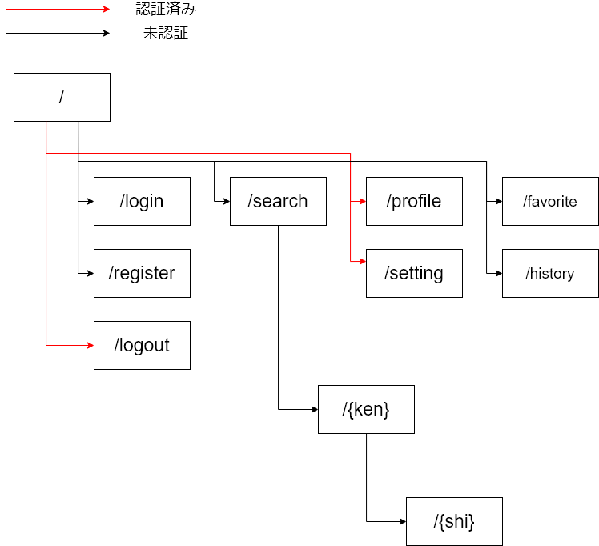

# rehome++ 設計書

## 環境
* PHP 7.4.8
* Laravel 8
* MySQL 8.0
* Composer 2.0.3

## ロゴ

## セットアップ
1. git clone https://github.com/kentaro-maker/rehome.git
2. composer install
3. php artisan migrate
4. php artisan db:seed
5. php artisan storage:link
6. php artisan serve

## Blade命名規則
x: 小文字　X:大文字

###### ○
* xxxx-xxxx.blade.php
###### ×
* xxxxXXXX.blade.php
* xxxx_xxxx.blade.php

※小文字と大文字を混在せず、ハイフンで分ける。

## 画面遷移図

## ルーティング
<table>
    <thead>
        <tr>
            <td>view</td>
            <td>controller</td>
            <td>path</td>
            <td>説明</td>
        </tr>
    </thead>
    <tbody>
        <tr>
            <td>landing-page</td>
            <td>LandingPageController</td>
            <td>/</td>
            <td>TOPページ</td>
        </tr>
        <tr>
            <td>-</td>
            <td>-</td>
            <td>/login</td>
            <td>自動作成</td>
        </tr>
        <tr>
            <td>-</td>
            <td>-</td>
            <td>/logout</td>
            <td>自動作成</td>
        </tr>
        <tr>
            <td>-</td>
            <td>-</td>
            <td>/register</td>
            <td>自動作成</td>
        </tr>
        <tr>
            <td>home</td>
            <td>HomeController</td>
            <td>/home</td>
            <td>ユーザの専用ページ</td>
        </tr>
        <tr>
            <td>serach</td>
            <td>SearchController</td>
            <td>/search</td>
            <td>条件付き検索ページ</td>
        </tr>
        <tr>
            <td>profile</td>
            <td>ProfileController</td>
            <td>/profile</td>
            <td>アカウント情報ページ</td>
        </tr>
        <tr>
            <td>setting</td>
            <td>SettingController</td>
            <td>/setting</td>
            <td>設定ページ</td>
        </tr>
        <tr>
            <td>city</td>
            <td>CityController</td>
            <td>/city</td>
            <td>未定</td>
        </tr>
    </tbody>
</table>

## 完成イメージ
* [グーネット](https://www.goo-net.com/)
* [カーセンサー](https://www.carsensor.net/)
* [価格ドットコム　自動車・バイク](https://kakaku.com/kuruma/used/)

こういう感じになる

## TODO
* Userの登録情報を変更できるようにする
* CityControllerの作成
* 検索部分 
    * 条件検索
        * 補助金別検索
        * 現居住地から距離検索
        * 出身地から距離検索
        * 都市へのアクセス検索
        *画像ギャラリーから検索
        など
    * 質問検索
        * 今の職業への満足度
        * 生活に求めるもの
        * 行政に求めるもの